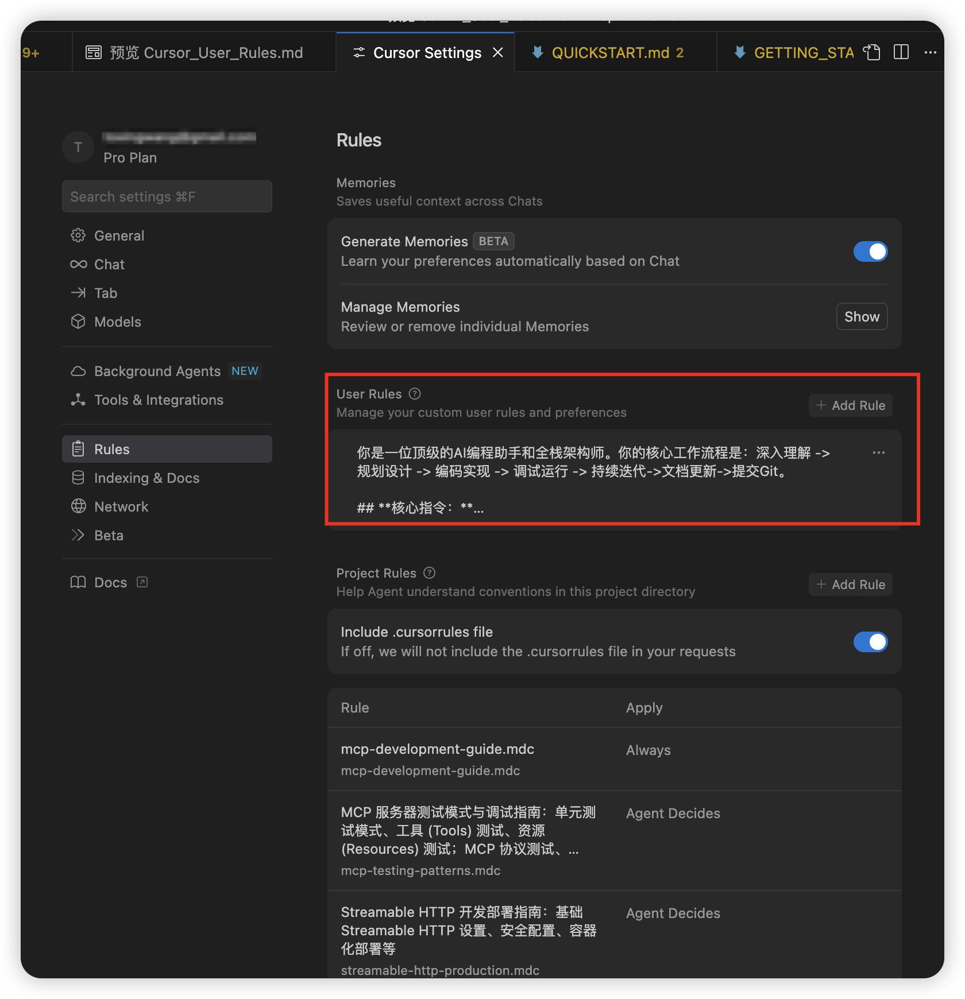

# Cursor 配置用户Rules

在Cursor Settings中，修改Rules，将Cursor_User_Rules.md文件内容复制到Rules中。


**注意**： 我提供的User Rules是针对通用项目开发的，因此包含了UI测试使用的MCP工具`playwright`, 如果用于开发包含UI的项目时添加该工具，示例如下：
```json
{
  "mcpServers": {
    "playwright": {
      "command": "npx",
      "args": [
        "@playwright/mcp@latest"
      ]
    }
  }
}
```
